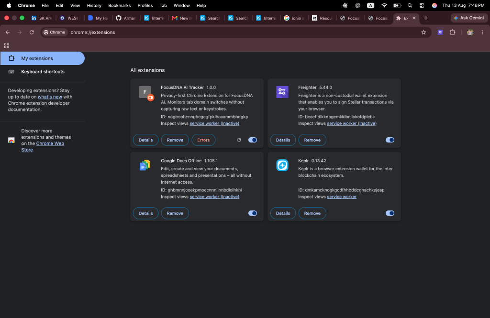
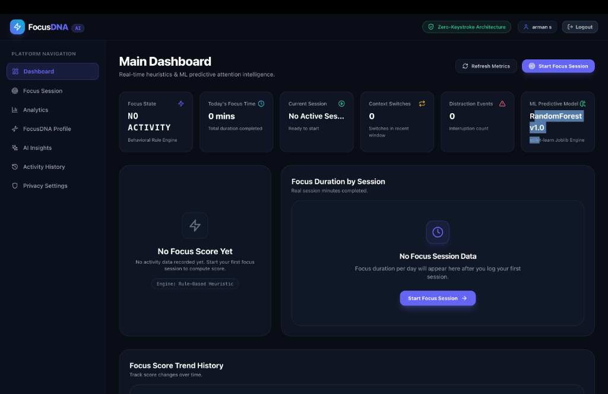
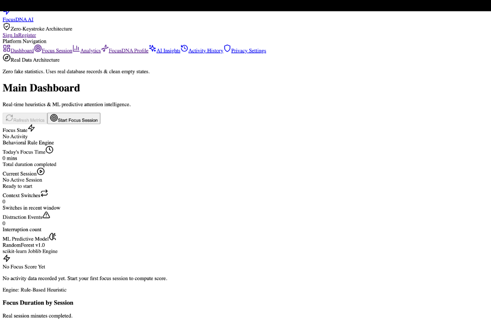
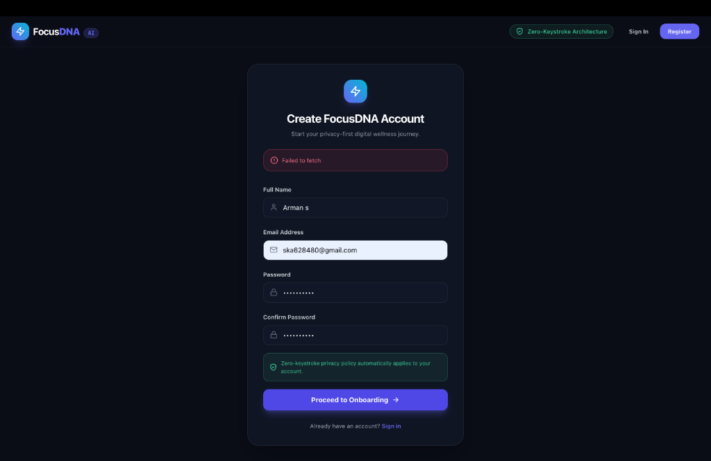
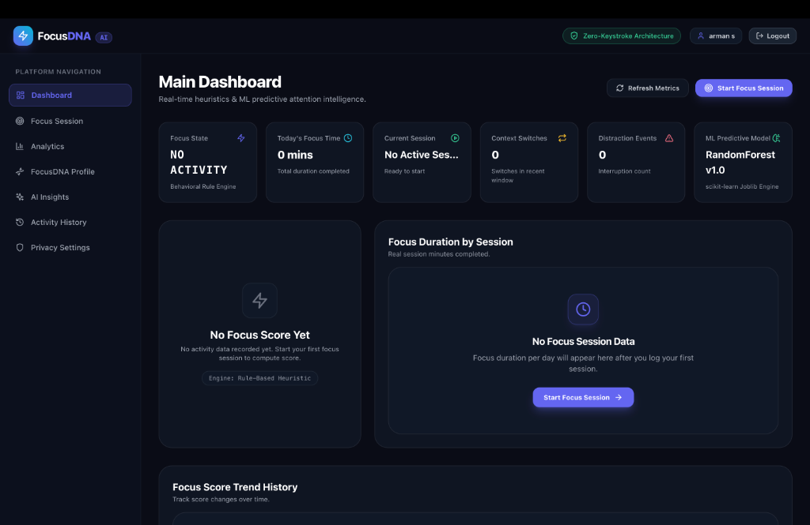
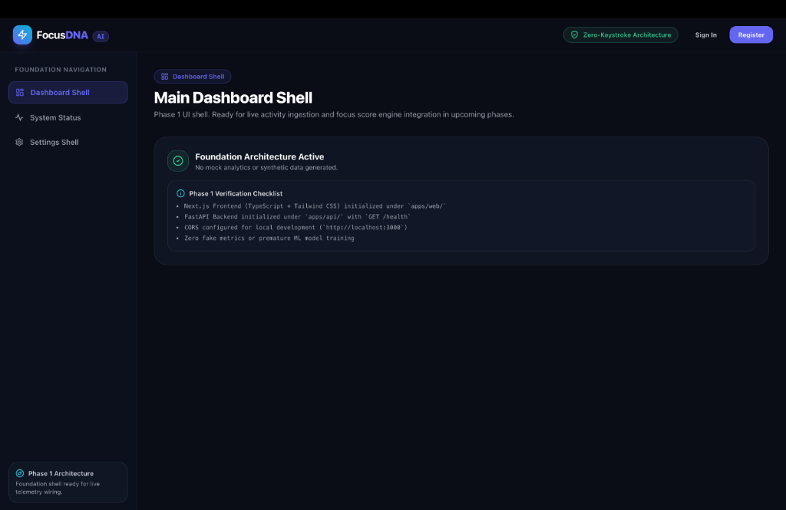
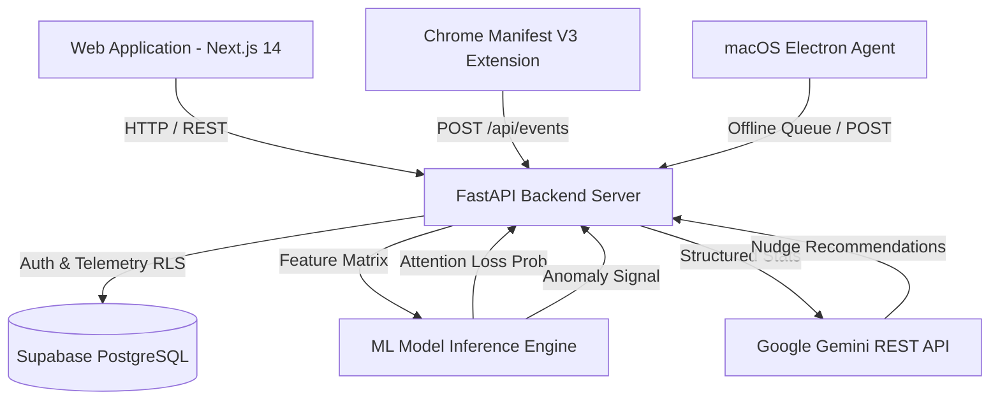

# FocusDNA AI

> **Privacy-first predictive attention intelligence that learns digital behavior and helps users understand and improve their focus.**


---

## Overview

### The Problem
Modern knowledge workers suffer from continuous cognitive fragmentation. Traditional productivity trackers log superficial hours or block websites indiscriminately, without understanding individual fatigue windows or context-switching dynamics.

### Why Existing Tools Fail
- **Indiscriminate Site Blockers**: Rigidly block productive research tabs without adapting to workflow needs.
- **Privacy Violations**: Many activity monitors log private text, keystrokes, screenshots, or email bodies.
- **Static Rules**: Basic pomodoro timers treat 9:00 AM energy identically to 3:00 PM afternoon fatigue.

### What FocusDNA Does
FocusDNA learns behavioral patterns associated with attention loss. By analyzing application switches, domain categories, session duration, and idle periods, FocusDNA predicts distraction windows before they derail focus and delivers personalized AI interventions using Google Gemini.

### Key Differentiator
- **Zero-Keystroke Architecture**: Tracks app names and domain categories ONLY. Keystrokes, passwords, private message text, screenshots, and clipboard contents are **100% blocked**.
- **Personalized Machine Learning**: Leverages Supervised Classifiers (F1-Score: `0.9776`) and Unsupervised `IsolationForest` anomaly detectors trained on individual behavioral telemetry.

---

## Demo

- **GitHub Repository**: [https://github.com/Armantech10/FocusDNA-AI](https://github.com/Armantech10/FocusDNA-AI)
- **Live Demo**: *Live demo coming soon.*

---

## Screenshots

| Dashboard Interface | Personal FocusDNA Profile |
| :---: | :---: |
|  |  |

| AI Recommendations & Interventions | Behavioral Analytics & Model Feedback |
| :---: | :---: |
|  |  |

| Privacy Controls & Data Rights | Focus Session Timer |
| :---: | :---: |
|  |  |

---

## Features

### Implemented (`[x]`)
- **Personalized FocusDNA Profile**: Computes typical focus session duration, peak focus hours, context-switch rates, top distraction triggers, and consistency metrics from real telemetry.
- **Focus Session Engine**: Pomodoro timer with dynamic focus scoring, pause/cancel controls, and local storage fallback.
- **Behavioral Activity Tracker**: Aggregates 5-minute telemetry windows into productive, distracting, and neutral categories.
- **Context-Switching & Anomaly Detection**: Unsupervised `IsolationForest` model flags unusual spike behaviors (e.g. 90m entertainment spikes).
- **ML Prediction Pipeline**: Supervised Gradient Boosted Trees classifier (`F1-Score: 0.9776`) predicting attention loss.
- **AI Recommendation Engine**: REST API integration with Google Gemini server-side, 15-minute response caching, 10 req/min rate limiting, and heuristic fallback.
- **User Feedback Learning Loop**: 5 evaluation buttons (`Helpful`, `Not helpful`, `I was actually focused`, `I was distracted`, `Don't remind me again`) with controlled offline retraining pipeline.
- **Privacy Rights Dashboard**: Export My Data (`JSON`), Delete All Data, Pause Tracking, and Revoke Consent.
- **macOS Electron Desktop Agent**: Native process poller, system idle detector, IPC bridge, and offline event queue manager.
- **Chrome Manifest V3 Extension**: Domain telemetry tracker with background service worker.

### In Development (`[/]`)
- Real-time WebSocket attention score streaming between desktop agent and web dashboard.

### Planned (`[ ]`)
- Native Windows `User32.dll` desktop window tracker.
- Mobile companion application.

---

## How It Works

```
User Workflow Telemetry (App Names & Web Domains ONLY)
                       ↓
Browser Extension & macOS Electron Desktop Agent
                       ↓
Offline Queueing & Secure Telemetry Transmit (POST /api/events)
                       ↓
Behavioral Feature Aggregator (5-min window aggregation)
                       ↓
Rule-Based Scorer & ML Predictive Models (Gradient Boosted Trees + Isolation Forest)
                       ↓
Google Gemini AI Recommendation Engine (POST /api/ai/recommendation)
                       ↓
FocusDNA Dashboard & Interactive User Feedback Loop
                       ↓
Controlled Offline Retraining Pipeline (Evaluation Gated)
```

> **Privacy Boundary**: Telemetry telemetry contains application process names, domain categories, duration, and idle seconds ONLY. Keystrokes, typing speed, form inputs, emails, and screenshots are NEVER captured or processed.

---

## Architecture

For full architectural specs, see [docs/ARCHITECTURE.md](docs/ARCHITECTURE.md).



---

## Tech Stack

| Layer | Technology | Purpose |
| :--- | :--- | :--- |
| **Frontend** | Next.js 14 (App Router), React 18, TailwindCSS | Responsive glassmorphic web interface |
| **Data Visualization** | Recharts, Lucide React Icons | Interactive focus score trends & app switch charts |
| **Backend API** | FastAPI (Python 3.9), Pydantic v2, Gunicorn | High-performance async REST API microservices |
| **Database & Auth** | Supabase PostgreSQL, Row-Level Security (RLS) | Tenant-isolated user authentication & telemetry storage |
| **Machine Learning** | Scikit-Learn, Joblib, NumPy, Pandas | Supervised Gradient Boosted Trees & Isolation Forest anomaly detection |
| **Generative AI** | Google Gemini 1.5 Flash REST API | Server-side structured recommendation generation |
| **Browser Extension** | Chrome Manifest V3, TypeScript, WebExtension API | Domain tab switch telemetry & offline storage |
| **Desktop Agent** | Electron 28, Node.js, macOS `osascript` / `ioreg` | Application window polling & system idle detection |
| **Containerization** | Docker, Docker Compose | Multi-stage production container deployment |
| **Testing** | Pytest, TestClient, Node.js Test Harness | End-to-end backend and offline queue testing |

---

## Machine Learning & AI

The FocusDNA ML pipeline processes structured behavioral feature vectors `(app_switches, idle_seconds, distraction_ratio, average_session_duration)`:

1. **Supervised Classifier Comparator**:
   - Evaluated **Random Forest** vs **Gradient Boosted Trees** on identical benchmark datasets.
   - **Winner**: Gradient Boosted Trees achieved **`F1-Score: 0.9776`** (Precision: `0.9850`, Recall: `0.9704`) vs Random Forest (`0.9773`).
   - Serialized artifact packaged in [ml/models/attention_loss_model.joblib](ml/models/attention_loss_model.joblib).

2. **Unsupervised Anomaly Detector**:
   - `IsolationForest` model detects individual user deviations (e.g. 90-minute entertainment spikes over baseline 10 minutes/day).
   - Serialized artifact packaged in [ml/models/anomaly_model.joblib](ml/models/anomaly_model.joblib).

3. **ML Safety & Controlled Retraining Pipeline**:
   - **No Instant Retraining**: On-the-fly model retraining upon receiving HTTP requests is strictly prohibited to prevent data poisoning.
   - Offline batch script [ml/pipeline/retrain_pipeline.py](ml/pipeline/retrain_pipeline.py) evaluates candidate models against active baselines and promotes updates **only when evaluation gates pass**.

---

## Privacy by Design

- 🛡️ **Zero-Keystroke Architecture**: Zero typing text, form credentials, or keystrokes captured.
- 🚫 **No Screenshots or Clipboard**: Screen capturing and clipboard inspection are completely disabled.
- 💾 **User Data Rights**:
  - **Export My Data**: Download complete `JSON` backup via `GET /api/privacy/export`.
  - **Delete My Data**: Permanently purge all database history via `POST /api/privacy/purge`.
  - **Pause Tracking**: Temporarily suspend telemetry via `PUT /api/privacy`.
  - **Revoke Consent**: Revoke permissions via `POST /api/privacy/revoke`.

---

## Repository Structure

```
FocusDNA/
├── apps/
│   ├── web/                    # Next.js 14 App Router Web Application
│   ├── api/                    # FastAPI Python Backend REST Services & Routers
│   ├── extension/              # Chrome Manifest V3 Extension (TypeScript)
│   └── desktop/                # macOS Electron Desktop Telemetry Agent
├── ml/                         # Machine Learning Pipeline & Serialized Models
│   ├── data/                   # Synthetic & Behavioral Dataset Generators
│   ├── docs/                   # ML Safety Lifecycle Documentation
│   ├── models/                 # Model Comparators, Trainers & Anomaly Detectors
│   ├── pipeline/               # Controlled Retraining Pipeline
│   └── reports/                # Model Evaluation Reports
├── docs/                       # System Architecture, API Specs, Database & Deployment Docs
│   ├── screenshots/            # Organized UI Demonstration Screenshots
│   ├── API.md                  # Comprehensive REST API Specification
│   ├── ARCHITECTURE.md         # Detailed Mermaid Architecture Spec
│   ├── DATABASE.md             # Supabase PostgreSQL Schema & RLS Policies
│   └── deployment.md           # Production Vercel & Docker Deployment Guide
├── Dockerfile                  # Production Multi-Stage Docker Build
├── docker-compose.yml          # Local Container Orchestration (FastAPI + Postgres)
├── .env.example                # Production Environment Variable Templates
├── .gitignore                  # Production Security File Exclusions
├── SECURITY.md                 # Security Architecture & Vulnerability Reporting Policy
├── CONTRIBUTING.md             # Open-Source Contribution Guidelines
├── CODE_OF_CONDUCT.md          # Contributor Covenant Code of Conduct
└── README.md                   # Project Documentation Overview
```

---

## Getting Started

### Prerequisites
- **Node.js**: `v18.0.0` or higher
- **Python**: `v3.9` or higher
- **Git**: `v2.30` or higher

### Installation

1. **Clone the Repository**:
   ```bash
   git clone https://github.com/Armantech10/FocusDNA-AI.git
   cd FocusDNA-AI
   ```

2. **Environment Setup**:
   ```bash
   cp .env.example .env
   cp apps/web/.env.example apps/web/.env.local
   cp apps/api/.env.example apps/api/.env
   ```

3. **Start FastAPI Backend**:
   ```bash
   PYTHONPATH=apps/api:ml python3 -m uvicorn main:app --host 127.0.0.1 --port 8000
   ```

4. **Start Next.js Web Frontend**:
   ```bash
   npm --prefix apps/web install
   npm --prefix apps/web run dev
   ```
   Open `http://localhost:3000/dashboard` in your browser.

5. **Run Backend Test Suite**:
   ```bash
   PYTHONPATH=apps/api:ml python3 -m pytest apps/api/tests
   ```

---

## API Documentation

See [docs/API.md](docs/API.md) for full REST API request/response schemas.

| Method | Endpoint | Purpose |
| :--- | :--- | :--- |
| `GET` | `/health` | Server status health check |
| `POST` | `/api/events` | Ingest activity telemetry events |
| `POST` | `/api/sessions` | Create focus session |
| `GET` | `/api/profile/focusdna` | Retrieve personalized behavioral profile |
| `POST` | `/api/ml/predict` | Predict attention loss probability |
| `POST` | `/api/ai/recommendation` | Generate Gemini AI interventions |
| `POST` | `/api/feedback` | Ingest user feedback on predictions |
| `GET` | `/api/privacy/export` | Download user data export (`JSON`) |

---

## Database Documentation

See [docs/DATABASE.md](docs/DATABASE.md) for complete Supabase PostgreSQL schema and Row-Level Security (RLS) policies.

---

## Roadmap

- [x] Next.js 14 Glassmorphism Dashboard UI & Interactive Recharts
- [x] FastAPI Telemetry Ingestion & Dynamic Rule Engine
- [x] Supervised ML Model Comparator (Gradient Boosted Trees F1: `0.9776`)
- [x] Unsupervised `IsolationForest` Anomaly Detection
- [x] Production ML Prediction API (`POST /api/ml/predict`)
- [x] Personalized FocusDNA Profile Engine (`/focusdna`)
- [x] Google Gemini AI Recommendation REST Integration with 15m Caching
- [x] User Feedback Learning Loop & Controlled Retraining Pipeline
- [x] macOS Electron Desktop Telemetry Agent with Offline Queue
- [x] Chrome Manifest V3 Extension with Domain Telemetry Tracker
- [x] User Data Rights APIs (Export Data, Delete Data, Pause Tracking, Revoke Consent)
- [x] Multi-Stage Production Docker Containerization & Vercel Deployment Config
- [ ] Native Windows Desktop Tracker (`win32` API abstraction)
- [ ] Real-time WebSocket Attention Score Streaming

---

## Contributing

We welcome open-source contributions! Please review [CONTRIBUTING.md](CONTRIBUTING.md) and [CODE_OF_CONDUCT.md](CODE_OF_CONDUCT.md) before submitting Pull Requests.

---

## License

This repository currently has no open-source license assigned. All rights reserved.
