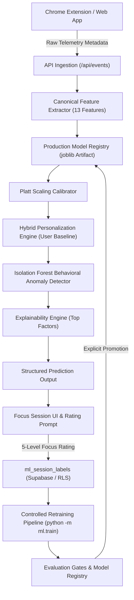

# FocusDNA AI — Machine Learning System Architecture

**Document Version**: 2.0  
**Scope**: Production-Grade ML Subsystem Lifecycle & Architecture  

---

## 1. System Architecture Overview

---

## 2. Core Subsystems

### A. Canonical Feature Pipeline (`ml/feature_schema.py`)
- **Version**: `FEATURE_SCHEMA_VERSION = "1.0"`
- **13 Features**:
  1. `total_duration_minutes`
  2. `app_switch_count`
  3. `browser_switch_count`
  4. `idle_minutes`
  5. `social_media_duration_minutes`
  6. `entertainment_duration_minutes`
  7. `productive_duration_minutes`
  8. `context_switch_frequency`
  9. `distraction_ratio`
  10. `active_time_ratio`
  11. `session_completion_ratio`
  12. `time_of_day_hour`
  13. `day_of_week`

### B. Session Labeling System (`infrastructure/supabase/migrations/003_ml_session_labels.sql` & `ml/labeling.py`)
- Human 5-level Focus Rating:
  - Rating 1 (*Very focused*) / 2 (*Mostly focused*) $\rightarrow$ Binary Target `0` (Focused)
  - Rating 3 (*Neutral*) / 4 (*Distracted*) / 5 (*Very distracted*) $\rightarrow$ Binary Target `1` (Distracted / Attention Loss)

### C. Leakage-Safe Splitting Engine (`ml/dataset.py`)
- Sorts chronologically (`time_aware`) or groups by `focus_session_id` to ensure zero session, user, or time leakage between train, validation, and test sets.

### D. Calibration & Registry Engine (`ml/calibration.py` & `ml/model_registry.py`)
- Fits Platt Scaling (sigmoid calibration) on validation probabilities.
- Registry tracks model versioning (`v1.0.0-PrototypeBaseline`, `v1.1.0`), dataset type (`synthetic_baseline` vs `real_labeled`), metrics, and provides atomic rollback (`model_registry.rollback_production()`).

### E. Hybrid Personalization Engine (`ml/personalization.py`)
- Dynamic sample count thresholds:
  - `< 10` labeled sessions: Global prototype model only.
  - `10 - 30` labeled sessions: Global model + user baseline statistical adjustment.
  - `30+` labeled sessions: Fully personalized calibrated adaptation.

### F. Anomaly & Drift Engine (`ml/models/anomaly_detector.py` & `ml/drift.py`)
- Isolation Forest identifies behavioral outliers compared to baseline user norms.
- Population Stability Index (PSI) monitors feature distribution drift across production windows.
